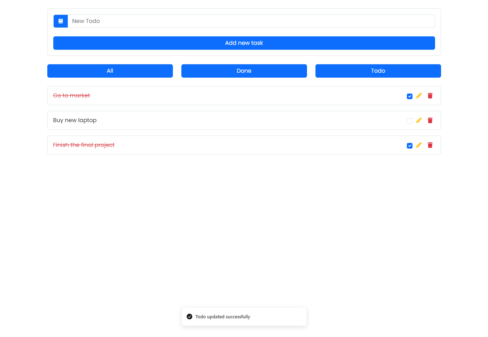
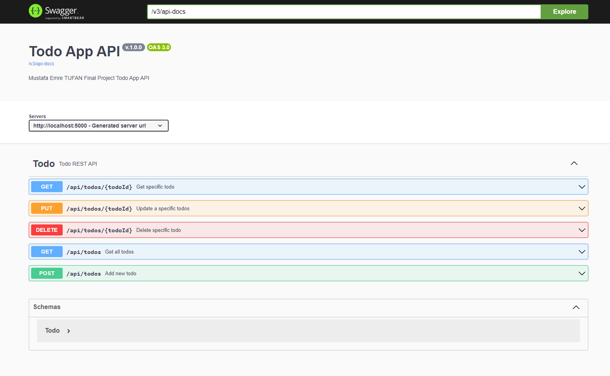
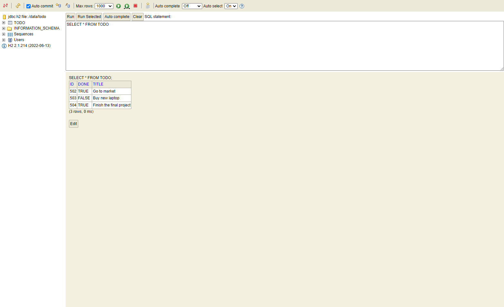

# TechCareer Fullstack Bootcamp Final Project

## Screenshots





## Tech

#### Backend

---

- Java
- Java Spring Boot

#### Frontend

---

- React
- Typescript
- Bootstrap

## Get project on your local

```bash
git clone https://github.com/emretfn/TechCareerFullstackBootcamp
```

## Usage

##### How to run backend

```bash
#Locate to server folder
cd server

# Install maven dependencies
mvn clean install

# Run Java Spring Boot App
mvn spring-boot:run
```

You can run with Intellij IDE without this commands.

##### How to run frontend

```bash
#Locate to client folder
cd client

#Install dependencies
pnpm install

#Run client app
pnpm dev
```

After running frontend and backend

`localhost:5173` is the frontend
`localhost:5000` is the backend
`localhost:5000/swagger-ui.html` is the swagger docs for backend
`localhost:5000/h2-console` is the H2DB for the backend
